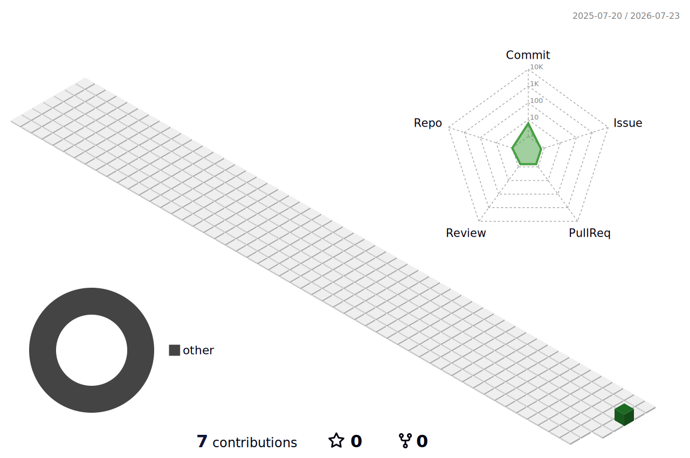

<!-- ============================================================= -->
<!--                     TIVENTHAN — GITHUB PROFILE               -->
<!-- ============================================================= -->

<div align="center">


<a href="https://git.io/typing-svg">
  
</a>

<br/>

-CGPA%203.67%2F4.00-7C3AED?style=for-the-badge&logo=googlescholar&logoColor=white)


<br/>

<a href="https://tiven-portfolio.vercel.app">
  
</a>
<a href="https://www.linkedin.com/in/tiventhan-63079534b">
  
</a>
<a href="mailto:tiventhan123@gmail.com">
  
</a>
<a href="https://github.com/Tiven0910">
  
</a>

<br/><br/>


</div>

---

## 👨‍💻 About Me

Final-year **Bachelor of Computer Science (Honours)** student and **Full-Stack Developer** who builds production web applications end to end.

- Backend-strong: **Laravel / PHP 8**, REST APIs, PostgreSQL & MySQL, role-based workflows.
- Full-stack: JavaScript, Tailwind, Bootstrap & Blade — schema to polished UI.
- Shipped production features used by major Malaysian enterprises — **Malaysia Airports (MAHB), Pos Malaysia, and CTOS**.
- Hands-on **Kotlin Multiplatform** mobile experience (Jetpack Compose).
- ~2 years delivering custom software for real freelance clients, end to end.

**Open to:** `Full-Stack Developer` · `Web Developer` roles — Malaysia / Remote.

---

## 🧰 Tech Stack

<div align="center">


</div>

<br/>

| | |
| :--- | :--- |
| **Languages** | PHP · Kotlin · Java · JavaScript (ES6+) · SQL · HTML5 · CSS3 |
| **Frontend** | Tailwind CSS · Bootstrap · Blade |
| **Backend & Databases** | Laravel · Spring Boot · PostgreSQL · MySQL · Redis · Firebase · REST APIs |
| **Cloud, DevOps & Tooling** | Git · GitHub/Gitea · CI/CD (Gitea Actions) · Docker · Figma |

---

## 🗂️ Web Development Expertise

<div align="center">

| Domain | Proficiency | Details |
| :--- | :---: | :--- |
| **Backend Development** | `●●●●●` | Laravel · PHP 8 · Eloquent · REST APIs · role-based workflows |
| **Databases** | `●●●●○` | PostgreSQL · MySQL · schema design · query optimization |
| **Frontend Development** | `●●●●○` | JavaScript (ES6+) · Tailwind · Bootstrap · Blade · responsive UI |
| **Mobile Development** | `●●●○○` | Kotlin Multiplatform · Jetpack Compose |
| **DevOps & Delivery** | `●●●○○` | Git/Gitea · CI/CD (Gitea Actions) · Docker · SIT → UAT → Prod |

</div>

---

## 🚀 Featured Projects

| | Project | What it is | Stack |
| :---: | :--- | :--- | :--- |
| 🏢 | **KollectValley** | Multi-tenant enterprise accounts-receivable platform serving **Malaysia Airports, Pos Malaysia & CTOS** — dispute management, analytics dashboards, automated workflows | `Laravel` `PHP` `PostgreSQL` |
| 📱 | **KollectMobile-Core** | Kotlin Multiplatform Android field-collections app on feature-first Clean Architecture, backed by a Spring Boot proxy | `Kotlin` `Compose` `Ktor` |
| 💃 | **Dance Academy MS** | Full PHP/MySQL platform for a freelance client — responsive marketing site plus a secure self-service admin dashboard | `PHP` `MySQL` `Tailwind` |
| 🔎 | **Smart Job Seeking** | Final-year project — job portal connecting seekers and companies, with multi-role dashboards | `PHP` `MySQL` `Firebase` |

<details>
<summary><b>🔍 More detail on the Kollect systems</b></summary>
<br/>

**KollectValley** — built the role-based Dispute Manager module (access control across six user roles), an internal analytics dashboard (interactive charts, KPI metrics, status filtering), automated overdue-dispute reminder/auto-release scheduling, and a bulk invoice-email feature with batch PDF/ZIP generation. Shipped Local → SIT → UAT → Production via Git/Gitea.

**KollectMobile-Core** — built Jetpack Compose screens (Cases Tab, Borrower Profile) from Figma designs pulled via an MCP design-to-code workflow, with offline-first drafts, background sync, and Bearer/JWT auth through the Central proxy.

<sub>Both are private company codebases. Dance Academy is a private client project.</sub>

</details>

---

## 💼 Experience

**Web Developer Intern** — *Kollect Systems Sdn Bhd*
`Jan 2026 – Present · Malaysia`

Full-stack web development on **KollectValley**, an enterprise accounts-receivable platform delivered to Malaysia Airports (MAHB), Pos Malaysia, and CTOS.

- Built a complete role-based **Dispute Manager** module with access control across six user roles.
- Designed an internal analytics dashboard — interactive charts, KPI metrics, and status filtering.
- Automated overdue-dispute handling with a scheduled reminder-and-auto-release system.
- Built a bulk invoice-email feature (Pos Malaysia): batch PDF/ZIP generation with server-side processing.
- Contributed Jetpack Compose UI to KollectMobile-Core, a Kotlin Multiplatform Android app.

`Laravel` `PHP` `PostgreSQL` `Bootstrap` `JavaScript` `Kotlin Multiplatform` `Jetpack Compose`

<br/>

**Independent Web Developer** — *Freelance*
`2023 – Present · Remote / Malaysia`

- Delivered custom PHP/MySQL web systems for business clients, requirements → deployment → maintenance.
- Replaced manual workflows with database-driven CRUD modules and secure admin dashboards.
- Managed multi-environment deployment with Git branch promotion and Gitea webhook auto-deploy.

`PHP` `MySQL` `JavaScript` `Tailwind CSS`

---

## 🏆 Highlights

<div align="center">

| Highlight | Details |
| :--- | :--- |
| **Enterprise Delivery** | Shipped production features to MAHB, Pos Malaysia & CTOS |
| **Module Ownership** | Built a complete role-based Dispute Manager module from scratch |
| **Analytics** | Designed an internal DCA dashboard (charts, KPIs, filtering) |
| **Academic** | BCS (Hons) — CGPA 3.67 / 4.00 |
| **Freelance** | ~2 years delivering client software end to end |

</div>

---

## 📊 GitHub Analytics

<div align="center">


</div>

<!--
github-readme-stats (stats card + top-langs) and github-profile-trophy are
currently returning HTTP 503 / 402 — their free public instances are over
quota. Uncomment once those services are healthy again.


-->

---

## 🧊 3D Contribution Graph

<div align="center">



</div>

---

## 📈 Contribution Activity

<div align="center">


</div>

---

## 🐍 Contribution Snake

<div align="center">

<picture>
  <source media="(prefers-color-scheme: dark)" srcset="https://raw.githubusercontent.com/Tiven0910/Tiven0910/output/github-contribution-grid-snake-dark.svg">
  <source media="(prefers-color-scheme: light)" srcset="https://raw.githubusercontent.com/Tiven0910/Tiven0910/output/github-contribution-grid-snake.svg">
  
</picture>

</div>

---

## 🎯 Current Focus

```yaml
Learning:   [Advanced Laravel, System Design, Cloud Deployment]
Building:   [Production full-stack web apps, this developer portfolio]
Exploring:  [Kotlin Multiplatform, Spring Boot, Clean Architecture]
Open_To:    [Full-Stack / Web Developer roles — Malaysia / Remote]
```

---

## 🤝 Connect

<div align="center">

<a href="mailto:tiventhan123@gmail.com">
  
</a>
<a href="https://www.linkedin.com/in/tiventhan-63079534b">
  
</a>
<a href="https://github.com/Tiven0910">
  
</a>
<a href="https://tiven-portfolio.vercel.app">
  
</a>

</div>

---

<div align="center">

<i>"Building software that ships and holds up in production."</i>


</div>
